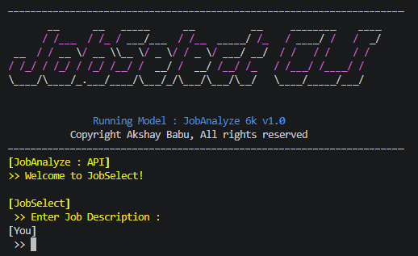
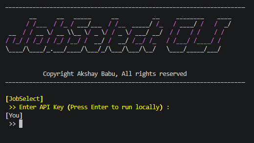

# Job Description Skill Classifier [JobSelect v0.11.2 & JobAnalyze 6k v1.0] (Multi-Label)

[](https://www.python.org/)
[](https://pytorch.org/)
[](https://scikit-learn.org/)
[](https://numpy.org/)
[](https://pandas.pydata.org/)

This project builds a lightweight text classification pipeline that predicts **multiple technical skills** from a job posting. Given a job description (optionally augmented with role and job type), the model outputs a ranked list of likely skills.



Installation:

- `pip install jobselect`

It uses:

- **TF-IDF** features over the combined text (job description + role + type)
- A **PyTorch feed-forward neural network** trained as a **multi-label** classifier
- **Per-skill thresholding** for evaluation and **top-k ranked probabilities** for inference

---

## What it does

1. **Data preparation** (`model/prep/data_prep.py`)
   - Reads cleaned job description data.
   - Normalizes/repairs common skill typos (e.g., `tesnorflow/pytorch` → `tensorflow/pytorch`).
   - Builds a **multi-hot** target vector of skills.
   - Fits a **TF-IDF** vectorizer (with n-grams) and splits into train/test.
   - Saves:
     - `model/prep/prepared_data.npz` (TF-IDF arrays + labels + indexes)
     - `model/prep/vectorizer.pkl` (fitted TF-IDF vectorizer)
     - `model/prep/label_vocab.json` (skill label vocabulary)

2. **Model training** (`model/model.py`)
   - Loads prepared TF-IDF arrays.
   - Defines a simple **MLP**:
     - Linear → ReLU → Dropout → Linear (one logit per skill)
   - Trains with `BCEWithLogitsLoss` (multi-label setting).
   - Saves:
     - `model_out/skill_classifier.pt` (model weights)
     - `model_out/training_history.json` (train/test loss curves)

3. **Evaluation** (`model/eval.py`)
   - Loads the trained model.
   - Applies a fixed sigmoid + threshold (**0.3**) to obtain binary skill predictions.
   - Reports:
     - Per-skill precision/recall/F1
     - Micro-F1 and Macro-F1
   - Compares against a simple baseline (frequency-driven / always-predict-most-frequent labels).

4. **Prediction / Inference** (`model/pred.py`)
   - Loads the TF-IDF vectorizer and trained model.
   - Creates TF-IDF features for the input text.
   - Outputs the **top-k** skills by probability.

---

## Use cases

- **Resume/job-post matching** (first-pass filtering of relevant skills)
- **Job taxonomy building** (discover recurring skills from postings)
- **Recruiting analytics** (aggregate predicted skill demand by seniority/role/type)
- **Prototyping multi-label NLP classifiers** (TF-IDF + MLP baseline)

---

## Project structure

```text
.
├─ data/
│  ├─ raw/
│  │  └─ Job_descriptions.csv                 # Raw input dataset
│  ├─ sample_data/
│  │  └─ test.txt                             # Example JD, Role and Type for testing
│  └─ clean/
│     ├─ cleaned_job_descriptions.csv         # Cleaned master CSV
│     ├─ cleaned_job_descriptions_internships.csv
│     ├─ cleaned_job_descriptions_junior.csv
│     └─ cleaned_job_descriptions_senior.csv
│
├─ model/
│  ├─ prep/
│  │  ├─ data_prep.py                         # TF-IDF + multi-hot label creation + train/test split
│  │  ├─ sym_map.py                           # Synonym/phrase normalization map used during prep
│  │  ├─ vectorizer.pkl                       # Saved TF-IDF vectorizer (generated by data_prep)
│  │  ├─ prepared_data.npz                    # Saved arrays (generated by data_prep)
│  │  └─ label_vocab.json                     # Skill label vocabulary (generated by data_prep)
│  │
│  ├─ model.py                                # PyTorch multi-label classifier training
│  ├─ eval.py                                 # Thresholded evaluation + F1 metrics + baseline comparison
│  └─ pred.py                                 # Predict top-k skills for new text
│
├─ model_out/
│  ├─ skill_classifier.pt                     # Trained model weights (generated by model.py)
│  └─ training_history.json                   # Training loss history (generated by model.py)
│
├─ cli/
│  ├─ jobselect.py                              # Rich terminal CLI (prompts + prints top skills)
│  ├─ model_select.py                           # Inference routing: API-first, LOCAL fallback (key resolved lazily)
│  └─ api_val.py                                # API key prompt / mode selection for CLI

│
├─ test/
│  └─ test_model.py                           # Pytest checks expected artifacts exist in model_out/ and model/prep/
│
├─ notebooks/
│  ├─ 01_EDA.ipynb                            # Exploratory Data Analysis
│  └─ 02_Data_Engineering.ipynb               # Data engineering / cleaning notes
│
├─ api/
│  ├─ JobAnalyze_API.py                       # FastAPI service + Pydantic validation + API-key verification
│  ├─ pred.py                                 # API/server-side prediction wrapper (imports model.pred)
│  └─ supabase_client.py                     # Optional API key persistence (Supabase)
│
├─ pipeline.py                                # Executes notebooks + training/eval steps in order
├─ pyproject.toml                             # Installs as a cli tool (jobselect)
├─ requirements.txt
└─ README.md

```

---

## Requirements

See `requirements.txt` for the exact dependencies.

---

## Getting started

### 1) Clone and Install dependencies

```bash
git clone https://github.com/Ak47xdd/Job-Description-Analysis.git
pip install -r requirements.txt
```

### 2) Run data preparation (optional)

This builds the TF-IDF features and label vocabulary from the cleaned CSV.

```bash
python model/prep/data_prep.py
```

Expected outputs:

- `model/prep/prepared_data.npz`
- `model/prep/vectorizer.pkl`
- `model/prep/label_vocab.json`

### 3) Train the model (optional)

```bash
python model/model.py
```

Expected outputs:

- `model_out/skill_classifier.pt`
- `model_out/training_history.json`

### 4) Evaluate performance (optional)

```bash
python model/eval.py
```

Outputs include:

- Per-skill metrics (precision/recall/F1)
- Micro-F1 and Macro-F1
- Baseline comparison

### 5) Predict skills for a new job description

#### Option A: Use Python function (LOCAL model)

`from api.pred import JobAnalyze_6k`

`data/sample_data/test.txt` contains an example job description inside. Use:

```python
JobAnalyze_6k(job_desc, role="AI Engineer", job_type="Junior", top_k=50)
```

#### Option B: Use the interactive CLI (API-first with validation)

```bash
python -m cli.jobselect

# or after install
pip install jobselect
jobselect
```

The CLI:

- prompts for **Job Description**, **Role**, and **Type**
- validates them via the API schema when running in API mode
- prints the top skills ranked by probability

---

#### Option C: Get Predictions through API (recommended)

Currently, the API service is under development, you could press `Enter` on first screen:

- The CLI will always prompt the user for an API Key, press `Enter` to skip to LOCAL Mode



#### Option D: Call the FastAPI service (optional)

Run `api/JobAnalyze_API.py`. Requests must include:

- header `JobAnalyze_6k_Key` with a valid API key
- JSON body with `Job_Desc`, `Role`, and `Type` (validated via Pydantic)

---

## How predictions work

- Text is concatenated as:
  `"{job_desc} {role} {job_type}"`
- TF-IDF transforms text into a fixed-size vector
- The network outputs one logit per skill
- Sigmoid converts logits → probabilities
- Skills are ranked by probability and the top-k are returned

---

## Important implementation notes

- **Multi-label learning:** Each skill is treated independently (binary relevance via sigmoid + `BCEWithLogitsLoss`).
- **Evaluation threshold:** `model/eval.py` uses a fixed threshold of **0.3**. For production use, you may want per-label thresholds tuned on a validation set.
- **Dataset size:** The included notebooks and evaluation code suggest the dataset may be small; results can be limited by label frequency and data coverage.

---

## New features / capabilities

- **Rich terminal CLI** (`cli/jobselect.py`) using `rich` + `pyfiglet` for interactive top-skill display.
- **API validation + schema enforcement**
  - Input validation via **Pydantic** model constraints in `api/JobAnalyze_API.py`.
  - API key auth via header + secure verification, with optional Supabase-backed storage in `api/supabase_client.py`.
  - CLI mode auto-detection (`cli/api_val.py` + `cli/model_select.py`): uses API when a key is available, otherwise falls back to local inference.
- **Synonym/phrase normalization hook** (`model/prep/sym_map.py`) applied during data preparation.
- **Pipeline runner** (`pipeline.py`) to execute notebooks and training steps in sequence.

---

## Customization ideas

- Improve text cleaning and skill normalization in `data_prep.py`
- Tune TF-IDF parameters (`max_features`, `ngram_range`, `min_df`)
- Replace the simple MLP with a stronger baseline (e.g., logistic regression on TF-IDF)
- Calibrate thresholds per label using validation data
- Add a CLI or web service endpoint for prediction

---

## References / Inspiration

This repository follows a common pattern for multi-label NLP baselines:
TF-IDF features + a simple neural network + sigmoid-based multi-label outputs.
